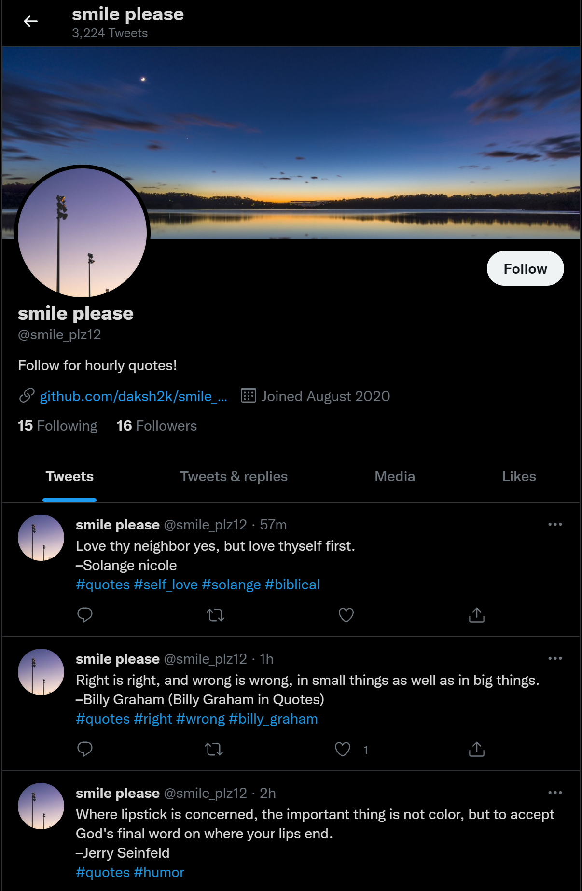
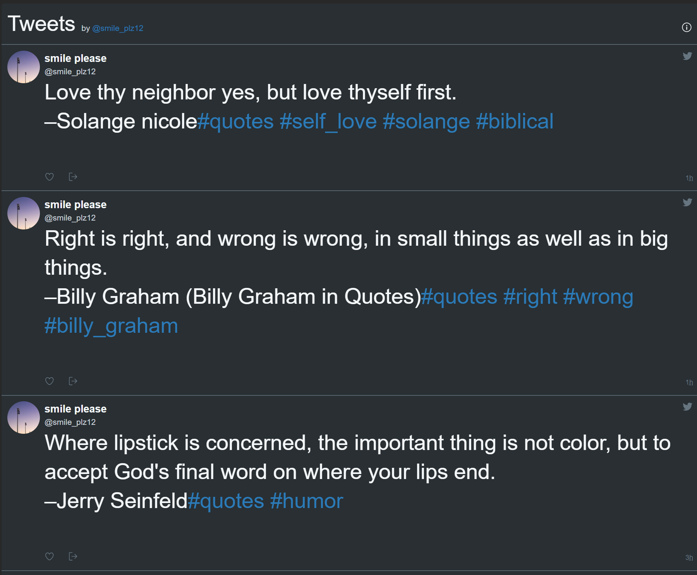

# Smile Please
 Twitter bot which tweets a new random quote hourly.
 Deployed on **[Replit](https://www.replit.com/@smileplz/smile-plz)**.

 Quotes powered by a custom 500k quotes dataset made from **[Goodreads](https://www.goodreads.com/quotes)** stored in MongoDB hosted at **[Mongo Atlas](https://www.mongodb.com/cloud/atlas)**.
 There is also a second method for getting quotes using the **[Forismatic API](https://forismatic.com/en/api/)**, which is added as a fallback.
 
 There is also support for dividing the tweet in 2 if it is longer than 280 chars.
 
 Checkout the tweets at:
 - ### Check out the bot at this **[Twitter Profile.](https://twitter.com/smile_plz12)**
 
 - ### Or on the **[Replit Website](https://smile-plz.smileplz.repl.co/)** where timeline is shown using **[Twitter Widgets](https://developer.twitter.com/en/docs/twitter-for-websites/timelines/overview)**.

## Requirements
- ### Get the twitter credentials from your Twitter Developer Account [here](https://developer.twitter.com/en/portal/projects-and-apps).
- ### To get access to Mongo Atlas. Register on [MongoDB Cloud](https://www.mongodb.com/cloud/atlas/register).
- ### For hosting. Register on [Replit](https://replit.com/signup) or choose any other provider of your choice.
## Usage
 For using this bot clone this repositary and install the dependencies from the [requirements](./requirements.txt) file.
 
- Enter your details in a .env file like this(for **Local Environment** ):
  - consumer_key = "XXXXXXXXXXXXXXXXXXXX"
  - consumer_secret = "XXXXXXXXXXXXXXXXXXXXXX" 
  - access_token = "XXXXXXXXXXXXXXXXXXXXXXX" 
  - access_token_secret = "XXXXXXXXXXXXXXXXXXXX" 
  - database_uri = "Your Mongo Atlas URI"
- ### Or set these variables in your deployed environment.

### Then run the [main.py](./main.py) file to execute your bot.
